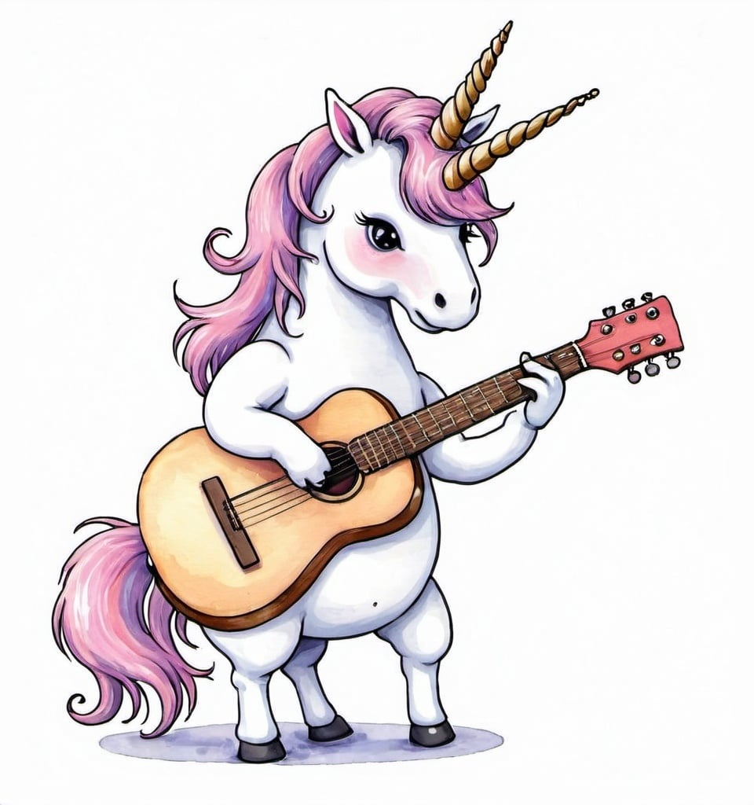

# O unicórnio que toca violão

## 📒 Descrição
A imagem abaixo foi gerada totalmente, com inteligência artificial.

## 🤖 Tecnologias Utilizadas
https://openart.ai/

## 🧐 Processo de Criação
Usando liguagem natural, e imagens de referência eu criei uma imagem de um unicórnio tocando violão.

## 🚀 Resultados
Apesar de o resultado se aproximar muito do resultado esperado, como pode ser percebido na imagem a ia acabou gerando de forma equivocada, um unicôrnio de "5 pernas", apesar desse problema pode ser corrigido, eu optei por manter essa falhas no projeto para mostrar que a ia apesar de conseguir emular algumas habilidades humanas, ainda necessita de aprimoramento.

## Imagem gerada por IA
